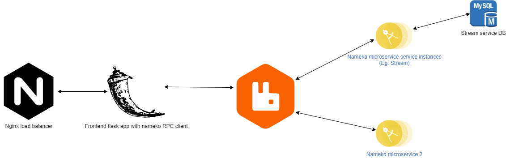

# Mtv - A representational project for microservice pattern
This project makes use of orchestaration based SAGA pattern. There are two major components in this :
* Frontend (A [Flask](https://flask.palletsprojects.com/en/2.0.x/) app)
* Message Broker ([RabbitMQ](https://www.rabbitmq.com/))
* Services (Spun by [Nameko](https://nameko.readthedocs.io/en/stable/))

The Frontend stands as a standalone gateway between the requests and the services. Here, the received HTTP requests are transformed to Nameko RPC calls
The RPC calls put the requests to a middleware message broker (RabbitMQ) which is then consumed by the services. 
The services are completely separated from the frontend, making scaling easier.

Below is an architecture diagram of the same, 



Thanks to docker, this complete micro service architecture can be spun in seconds for demo.

## Run the service:
* Make sure you have install `docker` and `docker-compose`. Follow [docker installation](https://docs.docker.com/engine/install) and [docker-compose installation](https://docs.docker.com/compose/install/) and enable the services
* `cd` to the project directory.
* Run the following command.
  ```bash
  docker-compose up --build 
  ```
  This might take some minutes initially as it downloads image and build images. One it get spun, the entire components along with service will be ready.
* Open-api(swagger-ui) is being used to show each service API document. It allows to test the services on the fly as well. To access the swagger docker for `stream` service go to http://localhost/swagger

## Frontend
The frontend is as mentioned  a flask app, which get the http API requests from client and these requests are transformed to nameko RPC calls, using [nameko standalone RPC](https://nameko.readthedocs.io/en/stable/built_in_extensions.html). which talks to the message broker.

## Stream Service
The stream service is a Nameko service that exposes api to get, add, delete movies. The http://localhost/swagger directly load the docs of the Stream service.
The underlying database is Mysql. This is an [sqlalchemy](https://docs.sqlalchemy.org/en/14/orm/tutorial.html) ORM based. Its allows to easily create the db schema and not to write custom queries. Also [marshmallow](https://marshmallow.readthedocs.io/en/stable/) is used to work with ORM for serialization, de-serialization of data from and to the mysql DB. 

-@github/sarathsprakash
